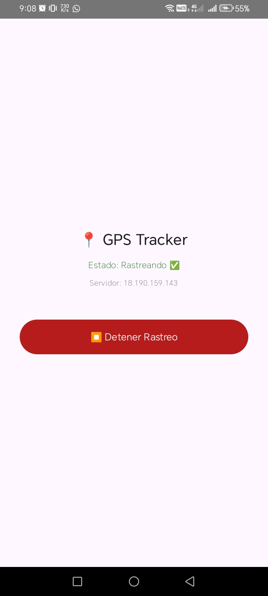

# 🚀 GPS Tracker — Sistema de Rastreo GPS en Tiempo Real

<div align="center">



*Aplicación Android para captura de ubicación*

---


*Dashboard web de visualización de recorridos*

</div>

---

## 👨‍💻 Autor

**Denis Jair Cancinas Cardenas**

---

## 📖 Descripción

Sistema completo de rastreo GPS que permite monitorear la ubicación de dispositivos Android en tiempo real, visualizar recorridos en un mapa interactivo y almacenar el historial de posiciones.

### Arquitectura del Sistema

```
┌─────────────────┐      ┌─────────────────┐      ┌─────────────────┐
│   Dispositivo   │      │    Servidor    │      │   Navegador    │
│   Android       │ ───► │   (FastAPI)    │ ───► │   (Mapa)       │
│                 │      │                 │      │                │
│ - LocationService│      │ - API REST     │      │ - Leaflet      │
│ - Room DB       │      │ - SQLite        │      │ - Dashboard    │
└─────────────────┘      └─────────────────┘      └─────────────────┘
```

---

## 🏗️ Componentes del Proyecto

| Componente | Descripción | README |
|-----------|-------------|--------|
| **GpsTracker** | App Android (Kotlin + Jetpack Compose) | [Ver](./GpsTracker/README.md) |
| **Servidor** | API REST (Python FastAPI) + Frontend web | [Ver](./Servidor/README.md) |

---

## ✨ Características Principales

- 📍 **Rastreo en tiempo real** — Ubicación cada 10 segundos
- 🔋 **Monitoreo de batería** — Registra nivel de batería del dispositivo
- 📊 **Visualización en mapa** — Recorridos interactivos con Leaflet + OpenStreetMap
- 🕐 **Filtrado por fecha y hora** — Consulta historial específico
- 🔄 **Sincronización offline** — Guarda localmente cuando no hay conexión
- 📱 **Multi-dispositivo** — Soporta múltiples dispositivos simultáneos

---

## ⚙️ Tecnologías

### 📱 Cliente Android
<div>


</div>

### 🌐 Servidor
<div>


</div>

---

## 🚀 Inicio Rápido

Para ejecutar el proyecto, consulta las instrucciones específicas de cada componente:

1. **GpsTracker**: [README](./GpsTracker/README.md)
2. **Servidor**: [README](./Servidor/README.md)

---

## 📂 Estructura

```
Proyecto_GPS/
├── imgs/              # Capturas de pantalla
│   ├── apk.png        # App Android
│   └── mapa.png       # Dashboard web
├── GpsTracker/        # Aplicación Android
└── Servidor/          # Backend + Frontend
```

---

## 📄 Licencia

MIT License — © 2026 Denis Jair Cancinas Cardenas